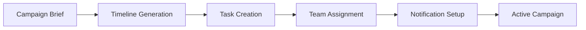
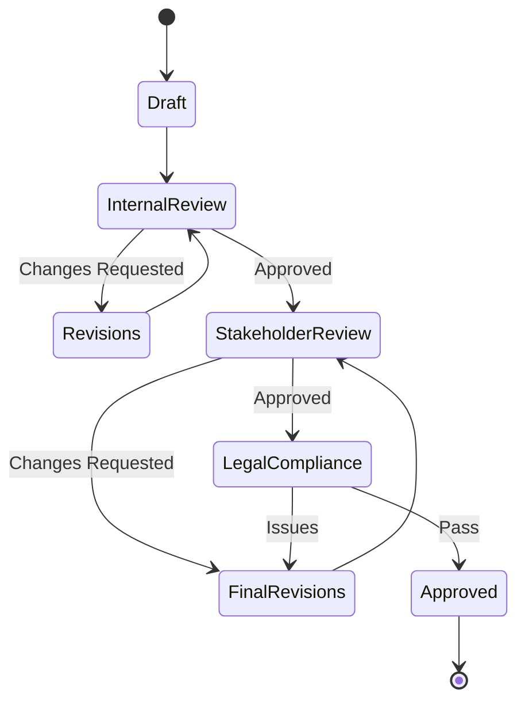
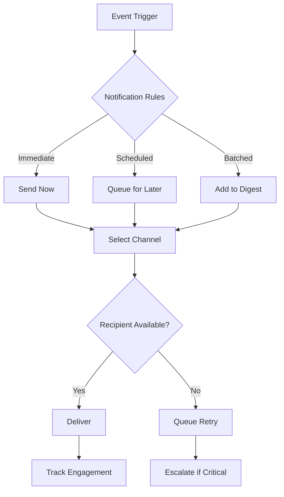
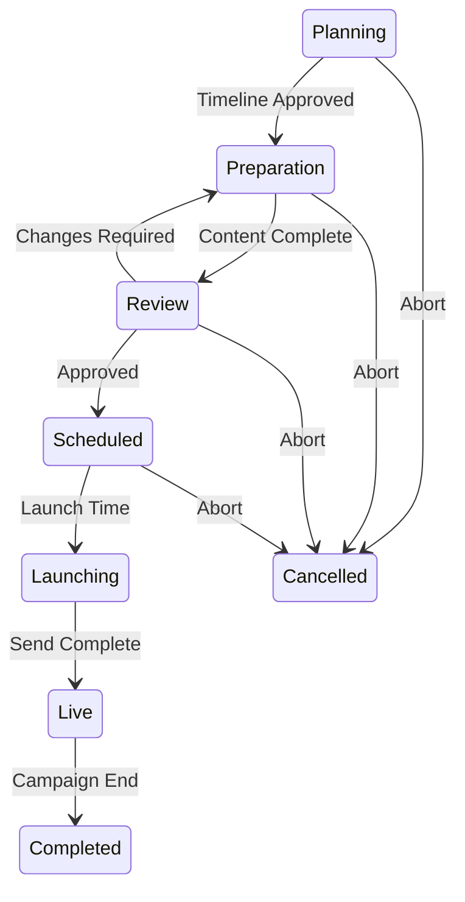

# Campaign Manager - Workflow Specification

## Document Information
- Version: 1.0
- Date: 2025-09-20
- Status: Active
- Purpose: Define campaign management workflows and business processes

## Core Workflows

### 1. Campaign Creation Workflow

#### Workflow Steps


#### Process Details

##### Step 1: Campaign Brief Ingestion
- **Trigger**: New campaign request from Marketing Agent or manual creation
- **Input**: Campaign name, type, target date, objectives
- **Validation**: Check for schedule conflicts, resource availability
- **Output**: Campaign record created with unique ID

##### Step 2: Timeline Generation
- **Logic**: Based on campaign type and complexity
- **Templates**: Email blast (3 days), Product launch (14 days), Webinar (21 days)
- **Milestones**: Content draft, design review, final approval, pre-launch check
- **Buffer**: Automatic buffer time based on campaign priority

##### Step 3: Task Breakdown
```typescript
interface CampaignTask {
  id: string;
  campaignId: string;
  title: string;
  description: string;
  assignee?: string;
  dueDate: Date;
  dependencies: string[];
  status: 'pending' | 'in_progress' | 'blocked' | 'completed';
  priority: 'low' | 'medium' | 'high' | 'critical';
}
```

##### Step 4: Intelligent Assignment
- Match tasks to team members based on skills
- Balance workload across team
- Consider availability and time zones
- Assign backup resources for critical tasks

##### Step 5: Notification Scheduling
- Initial assignment notifications
- Reminder schedule (48hr, 24hr, 4hr before due)
- Escalation triggers
- Completion confirmations

### 2. Content Approval Workflow

#### Approval Stages


#### Approval Rules
```typescript
interface ApprovalStage {
  stage: 'draft' | 'internal' | 'stakeholder' | 'legal' | 'final';
  approvers: string[];
  deadline: Date;
  unanimous: boolean;
  escalationPath: string[];
  autoApproveAfter?: number; // hours
}
```

### 3. Task Management Workflow

#### Task Lifecycle
1. **Creation**: Auto-generated from campaign template
2. **Assignment**: Matched to team member
3. **Notification**: Initial assignment alert
4. **Progress**: Regular status updates
5. **Blockers**: Escalation if blocked
6. **Review**: Quality check on completion
7. **Closure**: Mark complete and notify

#### Task States
```typescript
type TaskState =
  | 'draft'           // Being defined
  | 'ready'          // Ready for assignment
  | 'assigned'       // Assigned to team member
  | 'in_progress'    // Work started
  | 'in_review'      // Under review
  | 'blocked'        // Blocked by dependency
  | 'completed'      // Successfully completed
  | 'cancelled';     // No longer needed
```

### 4. Notification Workflow

#### Notification Types
```typescript
interface Notification {
  type: NotificationType;
  recipient: string;
  channel: 'email' | 'slack' | 'in-app';
  urgency: 'low' | 'normal' | 'high' | 'critical';
  payload: NotificationPayload;
  scheduleTime: Date;
  retryPolicy: RetryPolicy;
}

type NotificationType =
  | 'task_assigned'
  | 'task_reminder'
  | 'task_overdue'
  | 'approval_required'
  | 'campaign_milestone'
  | 'blocker_alert'
  | 'completion_summary';
```

#### Notification Logic


### 5. Escalation Workflow

#### Escalation Triggers
1. Task overdue by 24 hours
2. Blocker unresolved for 4 hours
3. No response to critical notification
4. Campaign at risk (< 48hr to launch)
5. Resource suddenly unavailable

#### Escalation Path
```typescript
const escalationLevels = [
  { level: 1, delay: 0, notify: ['assignee'] },
  { level: 2, delay: 4, notify: ['assignee', 'teamLead'] },
  { level: 3, delay: 12, notify: ['teamLead', 'manager'] },
  { level: 4, delay: 24, notify: ['manager', 'director'] },
  { level: 5, delay: 48, notify: ['director', 'vp'] }
];
```

### 6. Campaign Launch Workflow

#### Pre-Launch Checklist
```typescript
interface PreLaunchChecklist {
  campaign_id: string;
  checks: {
    content_approved: boolean;
    assets_uploaded: boolean;
    links_verified: boolean;
    list_prepared: boolean;
    tracking_configured: boolean;
    schedule_confirmed: boolean;
    team_notified: boolean;
    backup_assigned: boolean;
  };
  sign_off: {
    marketing_lead: string | null;
    content_lead: string | null;
    technical_lead: string | null;
  };
}
```

#### Launch Sequence
1. **T-24hr**: Final review meeting
2. **T-12hr**: Pre-flight checks begin
3. **T-4hr**: All systems verified
4. **T-1hr**: Team on standby
5. **T-0**: Campaign launched
6. **T+1hr**: Initial metrics check
7. **T+4hr**: Performance validation

### 7. Handoff to Marketing Agent

#### Handoff Package
```typescript
interface CampaignHandoff {
  campaignId: string;
  status: 'ready' | 'launched';
  metadata: {
    name: string;
    type: string;
    launchTime: Date;
    recipientCount: number;
    segments: string[];
  };
  assets: {
    emailTemplate: string;
    landingPages: string[];
    utmParameters: Record<string, string>;
  };
  team: {
    owner: string;
    contributors: string[];
  };
  performance_targets: {
    expectedOpens: number;
    expectedClicks: number;
    expectedConversions: number;
  };
}
```

## Automation Rules

### Smart Scheduling
```typescript
interface SchedulingRules {
  preferredSendTimes: {
    [day: string]: string[]; // e.g., "Tuesday": ["10:00", "14:00"]
  };
  blackoutDates: Date[];
  maxCampaignsPerDay: number;
  minTimeBetweenCampaigns: number; // hours
  audienceOverlapThreshold: number; // percentage
}
```

### Auto-Assignment Logic
```typescript
function assignTask(task: CampaignTask): string {
  const eligibleMembers = getEligibleMembers(task);
  const workloads = calculateWorkloads(eligibleMembers);
  const skills = matchSkills(task, eligibleMembers);
  const availability = checkAvailability(eligibleMembers, task.dueDate);

  return selectOptimalAssignee({
    eligibleMembers,
    workloads,
    skills,
    availability,
    priority: task.priority
  });
}
```

## Integration Points

### With Slack Manager
- Post campaign milestones to #traction channel
- Send DMs for task assignments
- Create threads for campaign discussions
- Alert on blockers and escalations

### With Marketing Agent
- Receive campaign performance feedback
- Share campaign metadata
- Update attribution data
- Sync customer engagement

### With Mailjet Agent
- Schedule email sends
- Verify technical configuration
- Check deliverability scores
- Monitor send status

## State Management

### Campaign States
```typescript
type CampaignState =
  | 'planning'      // Initial setup
  | 'preparation'   // Content creation
  | 'review'        // Approval process
  | 'scheduled'     // Ready to launch
  | 'launching'     // Being sent
  | 'live'          // Active campaign
  | 'completed'     // Finished
  | 'cancelled';    // Aborted
```

### State Transitions


## Error Handling

### Recovery Strategies
```typescript
interface ErrorRecovery {
  errorType: string;
  severity: 'low' | 'medium' | 'high' | 'critical';
  autoRecovery: boolean;
  manualIntervention: string[];
  rollbackProcedure: string;
  notificationList: string[];
}
```

## Success Metrics

### Workflow KPIs
- Average time from brief to launch
- Task completion rate
- On-time delivery percentage
- Escalation frequency
- Rework/revision cycles
- Team utilization rate

### Quality Metrics
- First-time approval rate
- Content quality scores
- Campaign readiness scores
- Post-launch issue rate

## Slack Traction Channel Integration

### When Campaign Manager Posts to #_traction Channel

The Campaign Manager communicates with the **#_traction** channel (ID: `C011CEK2406`) for the following pre-campaign coordination activities:

#### 1. Campaign Milestone Announcements
- **Trigger**: Major milestone completion
- **Frequency**: Real-time as milestones are reached
- **Content**:
  ```
  🎯 Campaign Milestone Reached

  Campaign: [Campaign Name]
  Milestone: [Milestone Name] ✅
  Completion: [Timestamp]

  📋 Progress: [X/Y] milestones complete
  ⏰ On Track: [Yes/No] for [Target Date]
  👥 Team: [Contributors]

  Next Up: [Next Milestone] due [Date]
  ```

#### 2. Campaign Launch Readiness
- **Trigger**: Pre-flight checks completion
- **Frequency**: 24 hours before launch
- **Content**:
  ```
  🚀 Campaign Ready for Launch

  Campaign: [Campaign Name]
  Launch Time: [Scheduled DateTime]

  ✅ Readiness Score: [Score]/100
  ✅ All content approved
  ✅ Technical checks passed
  ✅ Team assignments confirmed

  🔄 Handing off to Marketing Agent for execution
  ```

#### 3. Team Coordination Updates
- **Trigger**: Task assignments, blockers, or escalations
- **Frequency**: Real-time for critical items
- **Content**: Task assignments, blocker alerts, resource needs

#### 4. Campaign Status Changes
- **Trigger**: Status transitions (Planning → Preparation → Review → Scheduled)
- **Frequency**: When status changes occur
- **Content**: Status updates with timeline implications

#### 5. Risk Alerts and Escalations
- **Trigger**: Campaigns at risk, missed deadlines, resource conflicts
- **Frequency**: Real-time for urgent issues
- **Content**:
  ```
  ⚠️ Campaign Risk Alert

  Campaign: [Campaign Name]
  Risk Level: [High/Critical]
  Issue: [Description]

  Impact: [Timeline/Quality Impact]
  Action Needed: [Required Response]
  Owner: [Responsible Person]
  ```

### MCP Integration Details

```typescript
// Campaign Manager -> Slack Manager communication
const slackClient = new MCPClient({
  url: process.env.SLACK_MANAGER_URL,
  apiKey: process.env.SLACK_MCP_API_KEY
});

// Post milestone completion
await slackClient.callTool('send_message', {
  channel_id: process.env.SLACK_TRACTION_CHANNEL_ID,
  text: formatMilestoneUpdate(campaign, milestone)
});

// Send direct message for task assignment
await slackClient.callTool('send_direct_message', {
  user_id: teamMember.slackUserId,
  text: formatTaskAssignment(task)
});
```

### Coordination with Marketing Agent

**Handoff Process**:
1. Campaign Manager posts "Ready for Launch" to #_traction
2. Marketing Agent receives handoff notification
3. Campaign execution begins
4. Marketing Agent posts performance results back to #_traction

## 8. Weekly Summary Workflow

### Overview
The Campaign Manager automatically generates comprehensive weekly summaries every Monday at 0600 UTC, providing stakeholders with a complete overview of the week's scheduled campaign activities.

### Weekly Summary Generation

#### Trigger Schedule
```typescript
// Cron schedule for weekly summaries
const WEEKLY_SUMMARY_SCHEDULE = '0 6 * * 1'; // Every Monday at 06:00 UTC

interface WeeklySummaryConfig {
  schedule: string;
  channel: string;
  dashboardUrl: string;
  lookAheadDays: number;
  includeMetrics: boolean;
}

const config: WeeklySummaryConfig = {
  schedule: WEEKLY_SUMMARY_SCHEDULE,
  channel: '#traction',
  dashboardUrl: process.env.DASHBOARD_URL || 'https://campaign-manager.herokuapp.com/dashboard',
  lookAheadDays: 7,
  includeMetrics: true
};
```

#### Summary Components

##### 1. Week Overview
- Current week number and date range
- Total campaigns scheduled
- Total emails to be sent
- Key milestones for the week

##### 2. Campaign Schedule
```typescript
interface WeeklyCampaignSchedule {
  monday: CampaignActivity[];
  tuesday: CampaignActivity[];
  wednesday: CampaignActivity[];
  thursday: CampaignActivity[];
  friday: CampaignActivity[];
  saturday: CampaignActivity[];
  sunday: CampaignActivity[];
}

interface CampaignActivity {
  time: string;
  campaignName: string;
  roundNumber: number;
  recipientCount: number;
  type: 'launch' | 'milestone' | 'review' | 'preparation';
  status: 'scheduled' | 'in_progress' | 'completed';
}
```

##### 3. Key Metrics Forecast
- Expected total reach
- Projected engagement rates
- Resource allocation
- Capacity utilization

### Slack Notification Format

#### Weekly Summary Message Structure
```
━━━━━━━━━━━━━━━━━━━━━━━━━━━━━━━━━━━━━━━━━━
WEEKLY CAMPAIGN SCHEDULE
Week 42 • Oct 14-20, 2025
━━━━━━━━━━━━━━━━━━━━━━━━━━━━━━━━━━━━━━━━━━

📊 WEEK AT A GLANCE
• Campaigns: 3 active
• Total Recipients: 45,000
• Key Launches: 2
• Review Meetings: 4

📅 MONDAY, OCT 14
○ 10:00 AM - Product Launch Email (Round 1)
  Target: 15,000 users • Segment: Early Adopters

📅 TUESDAY, OCT 15
○ 2:00 PM - Content Review Meeting
  Campaign: Winter Newsletter

📅 WEDNESDAY, OCT 16
● 10:00 AM - Feature Announcement (Round 2)
  Target: 20,000 users • Segment: Active Users
○ 3:00 PM - Pre-flight Check
  Campaign: Webinar Invitation

📅 THURSDAY, OCT 17
○ 9:00 AM - Webinar Invitation Launch
  Target: 10,000 users • Segment: Enterprise

📅 FRIDAY, OCT 18
○ 11:00 AM - Performance Review
  Reviewing: Week's campaign metrics

🎯 KEY MILESTONES THIS WEEK
✓ Product launch sequence completion
○ Q4 campaign kickoff
○ Webinar registration open

📈 PERFORMANCE TRACKING
Last Week's Results:
• Emails Sent: 42,500
• Avg Open Rate: 24.3%
• Avg Click Rate: 3.2%
• Best Performer: Feature Update (28% open)

🔗 View Full Schedule Dashboard
[Click here for detailed campaign calendar]
━━━━━━━━━━━━━━━━━━━━━━━━━━━━━━━━━━━━━━━━━━
```

### Dashboard Integration

#### Campaign Schedule Dashboard
The weekly summary includes a link to a dedicated web dashboard providing:

##### Dashboard Features
1. **Calendar View**
   - Interactive weekly/monthly calendar
   - Campaign timeline visualization
   - Drill-down to individual campaigns

2. **Campaign Details Panel**
   - Full campaign information
   - Team assignments
   - Asset links
   - Approval status
   - Technical configuration

3. **Real-time Updates**
   - WebSocket connection for live status
   - Progress indicators
   - Completion notifications

4. **Metrics Overview**
   - Historical performance data
   - Trend analysis
   - Comparative metrics

##### Dashboard URL Structure
```typescript
interface DashboardRoutes {
  weekly: '/dashboard/schedule/week/:weekNumber';
  daily: '/dashboard/schedule/day/:date';
  campaign: '/dashboard/campaigns/:campaignId';
  metrics: '/dashboard/metrics/:dateRange';
}
```

### Automation Rules

#### Smart Summary Generation
```typescript
interface SummaryGenerationRules {
  // Include campaigns based on status
  includeStatuses: ['scheduled', 'in_progress', 'launching'];

  // Highlight criteria
  highlightCriteria: {
    largeCampaigns: { recipientCount: { min: 10000 } };
    criticalMilestones: true;
    upcomingDeadlines: { hoursAhead: 24 };
    performanceAlerts: true;
  };

  // Formatting preferences
  formatting: {
    useStatusIndicators: true;
    includeProgressBars: false;
    showTeamAssignments: true;
    maxCampaignsPerDay: 5;
  };
}
```

#### Notification Delivery
```typescript
async function generateWeeklySummary(): Promise<void> {
  const weekData = await aggregateWeeklyData();
  const summary = formatWeeklySummary(weekData);

  // Post to Slack
  await slackClient.postMessage({
    channel: '#traction',
    blocks: summary.blocks,
    unfurl_links: false,
    unfurl_media: false
  });

  // Log dashboard URL for tracking
  logger.info('Weekly summary posted', {
    week: weekData.weekNumber,
    campaignCount: weekData.campaigns.length,
    dashboardUrl: summary.dashboardUrl
  });
}
```

### Integration with Existing Workflows

#### Data Sources
1. **Campaign Service**: Active campaigns and schedules
2. **Task Service**: Upcoming milestones and deadlines
3. **Notification Service**: Scheduled notifications
4. **Analytics Service**: Historical performance data
5. **Team Service**: Resource availability

#### Update Triggers
The weekly summary is automatically regenerated when:
- New campaigns are scheduled
- Campaign dates are modified
- Campaigns are cancelled or postponed
- Major milestones are completed

### Success Metrics

#### Summary Effectiveness KPIs
- Click-through rate to dashboard
- Time spent on dashboard
- Team preparedness scores
- Campaign on-time launch rate
- Stakeholder engagement metrics

### Error Handling

#### Fallback Mechanisms
```typescript
interface SummaryErrorHandling {
  retryAttempts: 3;
  retryDelay: 300000; // 5 minutes
  fallbackChannel: '#campaign-alerts';
  notifyOnError: ['campaign-manager@company.com'];
  manualTriggerEndpoint: '/api/summary/generate';
}