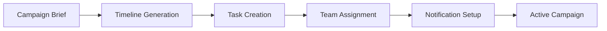
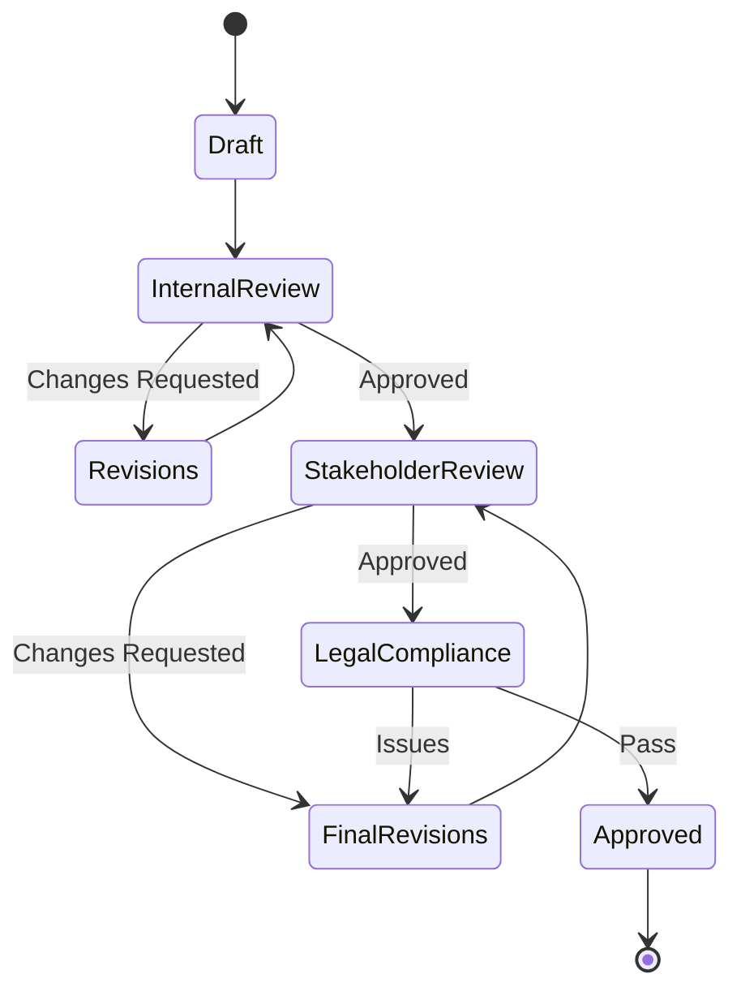
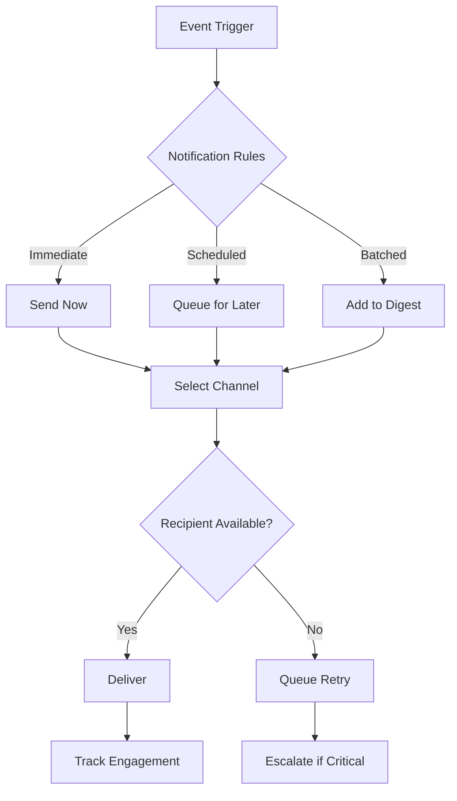
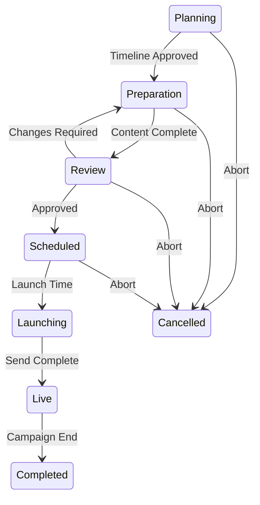

# Campaign Manager - Workflow Specification

## Document Information
- Version: 1.0
- Date: 2025-09-20
- Status: Active
- Purpose: Define campaign management workflows and business processes

## Core Workflows

### 1. Campaign Creation Workflow

#### Workflow Steps


#### Process Details

##### Step 1: Campaign Brief Ingestion
- **Trigger**: New campaign request from Marketing Agent or manual creation
- **Input**: Campaign name, type, target date, objectives
- **Validation**: Check for schedule conflicts, resource availability
- **Output**: Campaign record created with unique ID

##### Step 2: Timeline Generation
- **Logic**: Based on campaign type and complexity
- **Templates**: Email blast (3 days), Product launch (14 days), Webinar (21 days)
- **Milestones**: Content draft, design review, final approval, pre-launch check
- **Buffer**: Automatic buffer time based on campaign priority

##### Step 3: Task Breakdown
```typescript
interface CampaignTask {
  id: string;
  campaignId: string;
  title: string;
  description: string;
  assignee?: string;
  dueDate: Date;
  dependencies: string[];
  status: 'pending' | 'in_progress' | 'blocked' | 'completed';
  priority: 'low' | 'medium' | 'high' | 'critical';
}
```

##### Step 4: Intelligent Assignment
- Match tasks to team members based on skills
- Balance workload across team
- Consider availability and time zones
- Assign backup resources for critical tasks

##### Step 5: Notification Scheduling
- Initial assignment notifications
- Reminder schedule (48hr, 24hr, 4hr before due)
- Escalation triggers
- Completion confirmations

### 2. Content Approval Workflow

#### Approval Stages


#### Approval Rules
```typescript
interface ApprovalStage {
  stage: 'draft' | 'internal' | 'stakeholder' | 'legal' | 'final';
  approvers: string[];
  deadline: Date;
  unanimous: boolean;
  escalationPath: string[];
  autoApproveAfter?: number; // hours
}
```

### 3. Task Management Workflow

#### Task Lifecycle
1. **Creation**: Auto-generated from campaign template
2. **Assignment**: Matched to team member
3. **Notification**: Initial assignment alert
4. **Progress**: Regular status updates
5. **Blockers**: Escalation if blocked
6. **Review**: Quality check on completion
7. **Closure**: Mark complete and notify

#### Task States
```typescript
type TaskState =
  | 'draft'           // Being defined
  | 'ready'          // Ready for assignment
  | 'assigned'       // Assigned to team member
  | 'in_progress'    // Work started
  | 'in_review'      // Under review
  | 'blocked'        // Blocked by dependency
  | 'completed'      // Successfully completed
  | 'cancelled';     // No longer needed
```

### 4. Notification Workflow

#### Notification Types
```typescript
interface Notification {
  type: NotificationType;
  recipient: string;
  channel: 'email' | 'slack' | 'in-app';
  urgency: 'low' | 'normal' | 'high' | 'critical';
  payload: NotificationPayload;
  scheduleTime: Date;
  retryPolicy: RetryPolicy;
}

type NotificationType =
  | 'task_assigned'
  | 'task_reminder'
  | 'task_overdue'
  | 'approval_required'
  | 'campaign_milestone'
  | 'blocker_alert'
  | 'completion_summary';
```

#### Notification Logic


### 5. Escalation Workflow

#### Escalation Triggers
1. Task overdue by 24 hours
2. Blocker unresolved for 4 hours
3. No response to critical notification
4. Campaign at risk (< 48hr to launch)
5. Resource suddenly unavailable

#### Escalation Path
```typescript
const escalationLevels = [
  { level: 1, delay: 0, notify: ['assignee'] },
  { level: 2, delay: 4, notify: ['assignee', 'teamLead'] },
  { level: 3, delay: 12, notify: ['teamLead', 'manager'] },
  { level: 4, delay: 24, notify: ['manager', 'director'] },
  { level: 5, delay: 48, notify: ['director', 'vp'] }
];
```

### 6. Campaign Launch Workflow

#### Pre-Launch Checklist
```typescript
interface PreLaunchChecklist {
  campaign_id: string;
  checks: {
    content_approved: boolean;
    assets_uploaded: boolean;
    links_verified: boolean;
    list_prepared: boolean;
    tracking_configured: boolean;
    schedule_confirmed: boolean;
    team_notified: boolean;
    backup_assigned: boolean;
  };
  sign_off: {
    marketing_lead: string | null;
    content_lead: string | null;
    technical_lead: string | null;
  };
}
```

#### Launch Sequence
1. **T-24hr**: Final review meeting
2. **T-12hr**: Pre-flight checks begin
3. **T-4hr**: All systems verified
4. **T-1hr**: Team on standby
5. **T-0**: Campaign launched
6. **T+1hr**: Initial metrics check
7. **T+4hr**: Performance validation

### 7. Handoff to Marketing Agent

#### Handoff Package
```typescript
interface CampaignHandoff {
  campaignId: string;
  status: 'ready' | 'launched';
  metadata: {
    name: string;
    type: string;
    launchTime: Date;
    recipientCount: number;
    segments: string[];
  };
  assets: {
    emailTemplate: string;
    landingPages: string[];
    utmParameters: Record<string, string>;
  };
  team: {
    owner: string;
    contributors: string[];
  };
  performance_targets: {
    expectedOpens: number;
    expectedClicks: number;
    expectedConversions: number;
  };
}
```

## Automation Rules

### Smart Scheduling
```typescript
interface SchedulingRules {
  preferredSendTimes: {
    [day: string]: string[]; // e.g., "Tuesday": ["10:00", "14:00"]
  };
  blackoutDates: Date[];
  maxCampaignsPerDay: number;
  minTimeBetweenCampaigns: number; // hours
  audienceOverlapThreshold: number; // percentage
}
```

### Auto-Assignment Logic
```typescript
function assignTask(task: CampaignTask): string {
  const eligibleMembers = getEligibleMembers(task);
  const workloads = calculateWorkloads(eligibleMembers);
  const skills = matchSkills(task, eligibleMembers);
  const availability = checkAvailability(eligibleMembers, task.dueDate);

  return selectOptimalAssignee({
    eligibleMembers,
    workloads,
    skills,
    availability,
    priority: task.priority
  });
}
```

## Integration Points

### With Slack Manager
- Post campaign milestones to #traction channel
- Send DMs for task assignments
- Create threads for campaign discussions
- Alert on blockers and escalations

### With Marketing Agent
- Receive campaign performance feedback
- Share campaign metadata
- Update attribution data
- Sync customer engagement

### With Mailjet Agent
- Schedule email sends
- Verify technical configuration
- Check deliverability scores
- Monitor send status

## State Management

### Campaign States
```typescript
type CampaignState =
  | 'planning'      // Initial setup
  | 'preparation'   // Content creation
  | 'review'        // Approval process
  | 'scheduled'     // Ready to launch
  | 'launching'     // Being sent
  | 'live'          // Active campaign
  | 'completed'     // Finished
  | 'cancelled';    // Aborted
```

### State Transitions


## Error Handling

### Recovery Strategies
```typescript
interface ErrorRecovery {
  errorType: string;
  severity: 'low' | 'medium' | 'high' | 'critical';
  autoRecovery: boolean;
  manualIntervention: string[];
  rollbackProcedure: string;
  notificationList: string[];
}
```

## Success Metrics

### Workflow KPIs
- Average time from brief to launch
- Task completion rate
- On-time delivery percentage
- Escalation frequency
- Rework/revision cycles
- Team utilization rate

### Quality Metrics
- First-time approval rate
- Content quality scores
- Campaign readiness scores
- Post-launch issue rate