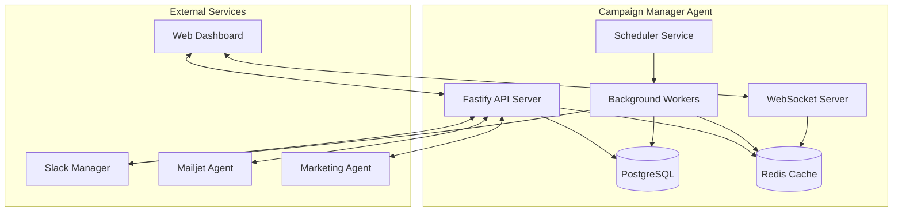
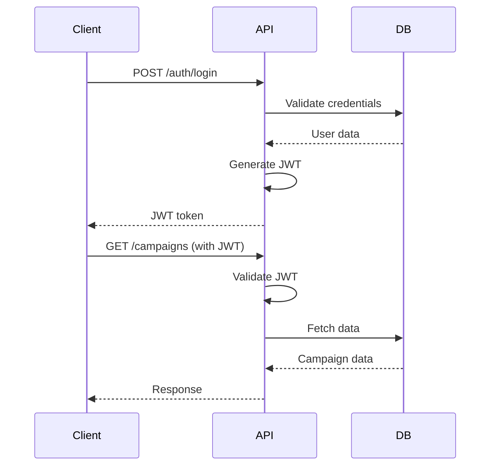

# Campaign Manager - Technical Architecture

## Document Information
- Version: 1.0
- Date: 2025-09-20
- Status: Active
- Purpose: Define technical architecture for Campaign Manager Agent
- Stack: TypeScript, Node.js, Fastify, PostgreSQL, Redis, BullMQ

## System Architecture Overview



## Technology Stack

### Core Technologies
- **Runtime**: Node.js 20+ with TypeScript 5.3+
- **Framework**: Fastify 4.x for high-performance REST API
- **Database**: PostgreSQL 15+ with Prisma ORM
- **Cache**: Redis 7+ for session and data caching
- **Queue**: BullMQ for background job processing
- **WebSocket**: Socket.io for real-time updates
- **Testing**: Jest 29+ with ts-jest
- **Documentation**: TypeDoc for API documentation

### Dependencies
```json
{
  "dependencies": {
    "fastify": "^4.25.0",
    "@fastify/cors": "^8.5.0",
    "@fastify/helmet": "^11.1.0",
    "@fastify/jwt": "^7.2.0",
    "@fastify/rate-limit": "^9.0.0",
    "@fastify/websocket": "^8.3.0",
    "socket.io": "^4.6.0",
    "@prisma/client": "^5.8.0",
    "bullmq": "^5.1.0",
    "ioredis": "^5.3.0",
    "node-cron": "^3.0.0",
    "zod": "^3.22.0",
    "winston": "^3.11.0",
    "date-fns": "^3.0.0",
    "@modelcontextprotocol/sdk": "^0.4.0"
  },
  "devDependencies": {
    "typescript": "^5.3.0",
    "jest": "^29.7.0",
    "ts-jest": "^29.1.0",
    "@types/node": "^20.10.0",
    "tsx": "^4.7.0",
    "tsup": "^8.0.0",
    "prisma": "^5.8.0"
  }
}
```

## Component Architecture

### 1. API Layer

#### Structure
```
src/api/
├── server.ts           # Fastify server setup
├── routes/
│   ├── campaigns.ts    # Campaign management endpoints
│   ├── tasks.ts       # Task management endpoints
│   ├── teams.ts       # Team coordination endpoints
│   ├── approvals.ts   # Approval workflow endpoints
│   └── webhooks.ts    # External service webhooks
├── middleware/
│   ├── auth.ts        # JWT authentication
│   ├── validation.ts  # Zod schema validation
│   ├── rateLimit.ts   # Rate limiting
│   └── logging.ts     # Request logging
└── schemas/
    ├── campaign.schema.ts
    ├── task.schema.ts
    └── approval.schema.ts
```

#### Fastify Configuration
```typescript
// src/api/server.ts
import Fastify from 'fastify';
import cors from '@fastify/cors';
import helmet from '@fastify/helmet';
import jwt from '@fastify/jwt';
import rateLimit from '@fastify/rate-limit';
import websocket from '@fastify/websocket';

export async function buildServer() {
  const server = Fastify({
    logger: {
      level: process.env.LOG_LEVEL || 'info',
      transport: {
        target: 'pino-pretty'
      }
    },
    bodyLimit: 10485760, // 10MB
    trustProxy: true
  });

  // Security plugins
  await server.register(helmet, {
    contentSecurityPolicy: false
  });

  await server.register(cors, {
    origin: process.env.CORS_ORIGIN || true,
    credentials: true
  });

  await server.register(rateLimit, {
    max: 100,
    timeWindow: '1 minute'
  });

  await server.register(jwt, {
    secret: process.env.JWT_SECRET!
  });

  await server.register(websocket);

  return server;
}
```

### 2. Database Layer

#### Schema Design
```prisma
// prisma/schema.prisma
generator client {
  provider = "prisma-client-js"
}

datasource db {
  provider = "postgresql"
  url      = env("DATABASE_URL")
}

model Campaign {
  id              String   @id @default(uuid())
  name            String
  type            String
  status          String
  targetDate      DateTime
  createdAt       DateTime @default(now())
  updatedAt       DateTime @updatedAt

  timeline        Timeline?
  tasks           Task[]
  approvals       Approval[]
  notifications   Notification[]
  assets          Asset[]
}

model Timeline {
  id              String     @id @default(uuid())
  campaignId      String     @unique
  campaign        Campaign   @relation(fields: [campaignId], references: [id])
  template        String
  milestones      Json
  criticalPath    String[]
  buffer          Int        // hours
  createdAt       DateTime   @default(now())
}

model Task {
  id              String     @id @default(uuid())
  campaignId      String
  campaign        Campaign   @relation(fields: [campaignId], references: [id])
  title           String
  description     String?
  assigneeId      String?
  assignee        TeamMember? @relation(fields: [assigneeId], references: [id])
  dueDate         DateTime
  priority        String
  status          String
  dependencies    String[]
  completedAt     DateTime?
  blockedReason   String?
  createdAt       DateTime   @default(now())
  updatedAt       DateTime   @updatedAt

  comments        Comment[]
  attachments     Attachment[]

  @@index([campaignId, status])
  @@index([assigneeId, dueDate])
}

model TeamMember {
  id              String     @id @default(uuid())
  email           String     @unique
  name            String
  role            String
  skills          String[]
  timezone        String
  slackUserId     String?
  availability    Json       // schedule
  maxConcurrent   Int        @default(5)
  createdAt       DateTime   @default(now())

  tasks           Task[]
  approvals       Approval[]
}

model Approval {
  id              String     @id @default(uuid())
  campaignId      String
  campaign        Campaign   @relation(fields: [campaignId], references: [id])
  stage           String
  approverId      String
  approver        TeamMember @relation(fields: [approverId], references: [id])
  status          String     // pending, approved, rejected
  comments        String?
  decidedAt       DateTime?
  deadline        DateTime
  createdAt       DateTime   @default(now())

  @@unique([campaignId, stage, approverId])
  @@index([status, deadline])
}

model Notification {
  id              String     @id @default(uuid())
  campaignId      String?
  campaign        Campaign?  @relation(fields: [campaignId], references: [id])
  type            String
  recipientId     String
  channel         String     // email, slack, in-app
  urgency         String
  payload         Json
  scheduledFor    DateTime
  sentAt          DateTime?
  readAt          DateTime?
  retries         Int        @default(0)
  createdAt       DateTime   @default(now())

  @@index([recipientId, sentAt])
  @@index([scheduledFor, sentAt])
}
```

### 3. Service Layer

#### Core Services
```typescript
// src/services/
├── campaign/
│   ├── campaign.service.ts       # Campaign lifecycle management
│   ├── timeline.service.ts       # Timeline generation
│   └── scheduling.service.ts     # Schedule optimization
├── task/
│   ├── task.service.ts          # Task management
│   ├── assignment.service.ts    # Intelligent assignment
│   └── escalation.service.ts    # Escalation handling
├── notification/
│   ├── notification.service.ts  # Notification orchestration
│   ├── slack.service.ts        # Slack integration
│   └── email.service.ts        # Email notifications
├── approval/
│   ├── approval.service.ts     # Approval workflow
│   └── validation.service.ts   # Content validation
└── integration/
    ├── mcp.service.ts          # MCP protocol handler
    ├── marketing.client.ts     # Marketing Agent client
    └── mailjet.client.ts      # Mailjet Agent client
```

### 4. Worker Architecture

#### BullMQ Configuration
```typescript
// src/workers/queue.config.ts
import { Queue, Worker, QueueScheduler } from 'bullmq';
import IORedis from 'ioredis';

const connection = new IORedis({
  host: process.env.REDIS_HOST,
  port: Number(process.env.REDIS_PORT),
  maxRetriesPerRequest: null,
});

export const queues = {
  notifications: new Queue('notifications', { connection }),
  tasks: new Queue('tasks', { connection }),
  escalations: new Queue('escalations', { connection }),
  reports: new Queue('reports', { connection }),
};

export const schedulers = {
  notifications: new QueueScheduler('notifications', { connection }),
  tasks: new QueueScheduler('tasks', { connection }),
};
```

#### Worker Implementation
```typescript
// src/workers/notification.worker.ts
import { Worker, Job } from 'bullmq';

export const notificationWorker = new Worker(
  'notifications',
  async (job: Job) => {
    const { type, recipient, channel, payload } = job.data;

    await job.updateProgress(10);

    switch (channel) {
      case 'slack':
        await sendSlackNotification(recipient, payload);
        break;
      case 'email':
        await sendEmailNotification(recipient, payload);
        break;
      case 'in-app':
        await sendInAppNotification(recipient, payload);
        break;
    }

    await job.updateProgress(100);
    return { sent: true, timestamp: new Date() };
  },
  {
    connection,
    concurrency: 10,
    limiter: {
      max: 100,
      duration: 1000,
    },
  }
);
```

### 5. Real-Time Updates

#### WebSocket Implementation
```typescript
// src/websocket/socket.server.ts
import { Server } from 'socket.io';
import { Redis } from 'ioredis';

export class SocketServer {
  private io: Server;
  private redis: Redis;

  constructor(httpServer: any) {
    this.io = new Server(httpServer, {
      cors: {
        origin: process.env.CORS_ORIGIN,
        credentials: true
      }
    });

    this.redis = new Redis({
      host: process.env.REDIS_HOST,
      port: Number(process.env.REDIS_PORT),
    });

    this.setupHandlers();
  }

  private setupHandlers() {
    this.io.on('connection', (socket) => {
      socket.on('subscribe:campaign', (campaignId: string) => {
        socket.join(`campaign:${campaignId}`);
      });

      socket.on('subscribe:user', (userId: string) => {
        socket.join(`user:${userId}`);
      });
    });

    // Redis pub/sub for cross-instance communication
    this.redis.on('message', (channel, message) => {
      const data = JSON.parse(message);
      this.io.to(channel).emit('update', data);
    });
  }

  public emitCampaignUpdate(campaignId: string, update: any) {
    this.io.to(`campaign:${campaignId}`).emit('campaign:update', update);
  }

  public emitTaskUpdate(userId: string, task: any) {
    this.io.to(`user:${userId}`).emit('task:update', task);
  }
}
```

### 6. MCP Integration

#### MCP Service Implementation
```typescript
// src/services/integration/mcp.service.ts
import { MCPClient } from '@modelcontextprotocol/sdk';

export class MCPService {
  private clients: Map<string, MCPClient>;

  constructor() {
    this.clients = new Map();
    this.initializeClients();
  }

  private async initializeClients() {
    // Marketing Agent
    this.clients.set('marketing', new MCPClient({
      name: 'campaign-manager',
      version: '1.0.0',
      serverUrl: process.env.MARKETING_AGENT_URL
    }));

    // Mailjet Agent
    this.clients.set('mailjet', new MCPClient({
      name: 'campaign-manager',
      version: '1.0.0',
      serverUrl: process.env.MAILJET_AGENT_URL
    }));

    // Slack Manager
    this.clients.set('slack', new MCPClient({
      name: 'campaign-manager',
      version: '1.0.0',
      serverUrl: process.env.SLACK_MANAGER_URL
    }));
  }

  async handoffCampaign(campaignId: string) {
    const client = this.clients.get('marketing');
    return client?.callTool('cm_campaign_launched', {
      campaign_id: campaignId,
      timestamp: new Date().toISOString()
    });
  }

  async postToSlack(channel: string, message: string) {
    const client = this.clients.get('slack');
    return client?.callTool('slack_post_message', {
      channel,
      message
    });
  }
}
```

### 7. Campaign Dashboard UI

#### Dashboard Architecture Overview
The Campaign Dashboard provides a read-only web interface for viewing campaign schedules, tracking progress, and monitoring performance metrics.

#### Dashboard Components
```
src/dashboard/
├── server.ts              # Express server for dashboard
├── routes/
│   ├── schedule.ts       # Schedule view routes
│   ├── campaigns.ts      # Campaign detail routes
│   └── metrics.ts        # Metrics dashboard routes
├── views/
│   ├── layouts/
│   │   └── main.hbs     # Main layout template
│   ├── schedule/
│   │   ├── weekly.hbs   # Weekly calendar view
│   │   └── daily.hbs    # Daily detail view
│   ├── campaigns/
│   │   ├── detail.hbs   # Campaign detail page
│   │   └── timeline.hbs # Campaign timeline view
│   └── metrics/
│       └── overview.hbs  # Metrics dashboard
├── public/
│   ├── css/
│   │   └── dashboard.css # Dashboard styles
│   └── js/
│       └── dashboard.js  # Client-side JavaScript
└── services/
    └── data.service.ts   # Dashboard data aggregation
```

#### Dashboard Routes
```typescript
// src/dashboard/routes/schedule.ts
interface DashboardRoutes {
  // Schedule Views
  '/dashboard/schedule': ScheduleOverview;
  '/dashboard/schedule/week/:weekNumber': WeeklyView;
  '/dashboard/schedule/day/:date': DailyView;

  // Campaign Views
  '/dashboard/campaigns': CampaignList;
  '/dashboard/campaigns/:id': CampaignDetail;
  '/dashboard/campaigns/:id/timeline': CampaignTimeline;

  // Metrics Views
  '/dashboard/metrics': MetricsOverview;
  '/dashboard/metrics/:dateRange': MetricsDetail;

  // API Endpoints for Real-time Data
  '/api/dashboard/schedule': ScheduleData;
  '/api/dashboard/campaigns/:id/status': CampaignStatus;
  '/api/dashboard/metrics/realtime': RealtimeMetrics;
}
```

#### Dashboard Data Models
```typescript
// Dashboard view models
interface DashboardSchedule {
  weekNumber: number;
  startDate: Date;
  endDate: Date;
  campaigns: CampaignSummary[];
  milestones: Milestone[];
  metrics: WeekMetrics;
}

interface CampaignSummary {
  id: string;
  name: string;
  status: CampaignStatus;
  scheduledDate: Date;
  recipientCount: number;
  progress: number;
  teamMembers: TeamMemberSummary[];
  nextMilestone: Milestone;
}

interface WeekMetrics {
  totalCampaigns: number;
  totalRecipients: number;
  completionRate: number;
  averageOpenRate: number;
  averageClickRate: number;
}
```

#### Real-time Updates via WebSocket
```typescript
// src/dashboard/services/realtime.service.ts
export class DashboardRealtimeService {
  private io: Server;

  constructor(httpServer: any) {
    this.io = new Server(httpServer, {
      path: '/dashboard/socket',
      cors: {
        origin: process.env.DASHBOARD_URL,
        credentials: true
      }
    });

    this.setupHandlers();
  }

  private setupHandlers() {
    this.io.on('connection', (socket) => {
      // Subscribe to campaign updates
      socket.on('subscribe:campaign', (campaignId: string) => {
        socket.join(`dashboard:campaign:${campaignId}`);
      });

      // Subscribe to schedule updates
      socket.on('subscribe:schedule', (week: number) => {
        socket.join(`dashboard:schedule:week${week}`);
      });

      // Subscribe to metrics updates
      socket.on('subscribe:metrics', () => {
        socket.join('dashboard:metrics');
      });
    });
  }

  // Emit updates to dashboard clients
  public emitCampaignUpdate(campaignId: string, update: any) {
    this.io.to(`dashboard:campaign:${campaignId}`)
      .emit('campaign:update', update);
  }

  public emitScheduleUpdate(week: number, schedule: any) {
    this.io.to(`dashboard:schedule:week${week}`)
      .emit('schedule:update', schedule);
  }

  public emitMetricsUpdate(metrics: any) {
    this.io.to('dashboard:metrics')
      .emit('metrics:update', metrics);
  }
}
```

#### Dashboard Frontend Implementation
```typescript
// src/dashboard/public/js/dashboard.js
class CampaignDashboard {
  constructor() {
    this.socket = io('/dashboard/socket');
    this.currentView = 'weekly';
    this.weekNumber = this.getCurrentWeek();
    this.init();
  }

  init() {
    this.subscribeToUpdates();
    this.bindEventHandlers();
    this.loadInitialData();
  }

  subscribeToUpdates() {
    // Subscribe to schedule updates
    this.socket.emit('subscribe:schedule', this.weekNumber);

    // Handle real-time updates
    this.socket.on('schedule:update', (data) => {
      this.updateScheduleView(data);
    });

    this.socket.on('campaign:update', (data) => {
      this.updateCampaignStatus(data);
    });

    this.socket.on('metrics:update', (data) => {
      this.updateMetrics(data);
    });
  }

  updateScheduleView(scheduleData) {
    // Update calendar view with new data
    const campaigns = scheduleData.campaigns;
    campaigns.forEach(campaign => {
      const element = document.querySelector(`[data-campaign-id="${campaign.id}"]`);
      if (element) {
        element.setAttribute('data-status', campaign.status);
        element.querySelector('.progress').style.width = `${campaign.progress}%`;
        element.querySelector('.recipient-count').textContent =
          campaign.recipientCount.toLocaleString();
      }
    });
  }

  updateCampaignStatus(campaignData) {
    // Update individual campaign status
    const statusIndicator = document.querySelector('.status-indicator');
    if (statusIndicator) {
      statusIndicator.className = `status-indicator status-${campaignData.status}`;
      statusIndicator.textContent = this.getStatusIcon(campaignData.status);
    }
  }

  getStatusIcon(status) {
    const icons = {
      'pending': '○',
      'in_progress': '◐',
      'active': '●',
      'completed': '✓',
      'failed': '✗'
    };
    return icons[status] || '○';
  }
}
```

#### Dashboard Styling
```css
/* src/dashboard/public/css/dashboard.css */
.dashboard-container {
  font-family: -apple-system, BlinkMacSystemFont, 'Segoe UI', Roboto, sans-serif;
  background: #f5f7fa;
  min-height: 100vh;
}

.calendar-view {
  display: grid;
  grid-template-columns: repeat(7, 1fr);
  gap: 1rem;
  padding: 2rem;
}

.campaign-card {
  background: white;
  border-radius: 8px;
  padding: 1rem;
  box-shadow: 0 2px 4px rgba(0,0,0,0.1);
  transition: transform 0.2s;
}

.campaign-card:hover {
  transform: translateY(-2px);
  box-shadow: 0 4px 8px rgba(0,0,0,0.15);
}

.status-indicator {
  display: inline-flex;
  align-items: center;
  justify-content: center;
  width: 24px;
  height: 24px;
  border-radius: 50%;
  font-size: 16px;
}

.status-pending { color: #6b7280; }
.status-in_progress { color: #3b82f6; }
.status-active { color: #10b981; }
.status-completed { color: #22c55e; }
.status-failed { color: #ef4444; }

.progress-bar {
  height: 4px;
  background: #e5e7eb;
  border-radius: 2px;
  overflow: hidden;
}

.progress-bar .progress {
  height: 100%;
  background: #3b82f6;
  transition: width 0.3s ease;
}
```

#### Dashboard Security
```typescript
// src/dashboard/middleware/auth.ts
export const dashboardAuth = async (req: Request, res: Response, next: NextFunction) => {
  // Read-only access - verify dashboard token
  const token = req.headers.authorization?.replace('Bearer ', '');

  if (!token) {
    // Generate shareable read-only link
    const readOnlyToken = generateReadOnlyToken({
      expiresIn: '7d',
      scope: 'dashboard:read'
    });

    res.redirect(`/dashboard/auth?token=${readOnlyToken}`);
    return;
  }

  try {
    const decoded = jwt.verify(token, process.env.DASHBOARD_SECRET!);
    req.dashboardAccess = decoded;
    next();
  } catch (error) {
    res.status(401).json({ error: 'Invalid dashboard access token' });
  }
};
```

#### Dashboard Performance Optimization
```typescript
// src/dashboard/services/cache.service.ts
export class DashboardCacheService {
  private cache: Redis;
  private ttls = {
    schedule: 60,      // 1 minute for schedule data
    campaign: 30,      // 30 seconds for campaign details
    metrics: 300,      // 5 minutes for metrics
  };

  async getCachedSchedule(weekNumber: number): Promise<DashboardSchedule | null> {
    const key = `dashboard:schedule:week${weekNumber}`;
    const cached = await this.cache.get(key);
    return cached ? JSON.parse(cached) : null;
  }

  async setCachedSchedule(weekNumber: number, data: DashboardSchedule) {
    const key = `dashboard:schedule:week${weekNumber}`;
    await this.cache.setex(key, this.ttls.schedule, JSON.stringify(data));
  }

  async invalidateScheduleCache(weekNumber: number) {
    await this.cache.del(`dashboard:schedule:week${weekNumber}`);
    // Notify dashboard clients
    this.io.to(`dashboard:schedule:week${weekNumber}`)
      .emit('cache:invalidated', { week: weekNumber });
  }
}

## Caching Strategy

### Redis Cache Layers
```typescript
// src/cache/cache.service.ts
export class CacheService {
  private redis: Redis;
  private ttls = {
    campaign: 3600,      // 1 hour
    task: 1800,          // 30 minutes
    team: 7200,          // 2 hours
    dashboard: 300,      // 5 minutes
  };

  async getCampaign(id: string): Promise<Campaign | null> {
    const key = `campaign:${id}`;
    const cached = await this.redis.get(key);
    if (cached) return JSON.parse(cached);

    const campaign = await prisma.campaign.findUnique({ where: { id } });
    if (campaign) {
      await this.redis.setex(key, this.ttls.campaign, JSON.stringify(campaign));
    }
    return campaign;
  }

  async invalidateCampaign(id: string) {
    await this.redis.del(`campaign:${id}`);
    await this.redis.publish('cache:invalidate', JSON.stringify({ type: 'campaign', id }));
  }
}
```

## Monitoring & Observability

### Logging Strategy
```typescript
// src/utils/logger.ts
import winston from 'winston';

export const logger = winston.createLogger({
  level: process.env.LOG_LEVEL || 'info',
  format: winston.format.json(),
  defaultMeta: { service: 'campaign-manager' },
  transports: [
    new winston.transports.File({ filename: 'error.log', level: 'error' }),
    new winston.transports.File({ filename: 'combined.log' }),
    new winston.transports.Console({
      format: winston.format.simple(),
    }),
  ],
});
```

### Health Checks
```typescript
// src/api/routes/health.ts
export async function healthRoutes(server: FastifyInstance) {
  server.get('/health', async () => ({
    status: 'healthy',
    timestamp: new Date().toISOString(),
  }));

  server.get('/health/detailed', async () => {
    const dbHealth = await checkDatabase();
    const redisHealth = await checkRedis();
    const queueHealth = await checkQueues();

    return {
      status: dbHealth && redisHealth && queueHealth ? 'healthy' : 'degraded',
      services: {
        database: dbHealth,
        redis: redisHealth,
        queues: queueHealth,
      },
    };
  });
}
```

## Security Architecture

### Authentication Flow


### Security Measures
- JWT-based authentication
- Rate limiting per endpoint
- Input validation with Zod
- SQL injection prevention (Prisma)
- XSS protection (Helmet)
- CORS configuration
- Environment variable encryption

## Deployment Architecture

### Container Strategy
```dockerfile
# Dockerfile
FROM node:20-alpine AS base
RUN corepack enable
WORKDIR /app

FROM base AS deps
COPY package.json pnpm-lock.yaml ./
RUN pnpm install --frozen-lockfile

FROM base AS build
COPY package.json pnpm-lock.yaml ./
RUN pnpm install --frozen-lockfile
COPY . .
RUN pnpm prisma generate
RUN pnpm build

FROM base AS runtime
COPY package.json pnpm-lock.yaml ./
RUN pnpm install --prod --frozen-lockfile
COPY --from=build /app/dist ./dist
COPY --from=build /app/prisma ./prisma
COPY --from=build /app/node_modules/.prisma ./node_modules/.prisma

EXPOSE 3001
CMD ["node", "dist/index.js"]
```

## Performance Optimization

### Optimization Strategies
- Connection pooling (PostgreSQL)
- Query optimization with indexes
- Pagination for large datasets
- Lazy loading of relationships
- Response compression
- CDN for static assets
- Background job processing

### Benchmarks
- API response time: <100ms (p95)
- WebSocket latency: <50ms
- Task assignment: <2 seconds
- Notification delivery: <5 seconds
- Dashboard load: <1 second

## Scalability Plan

### Horizontal Scaling
- Stateless API servers
- Redis for session storage
- Load balancer (nginx)
- Database read replicas
- Queue worker pools
- WebSocket clustering

### Capacity Planning
- 1000+ concurrent campaigns
- 100+ team members
- 10,000+ tasks per day
- 100,000+ notifications per day
- 1000+ WebSocket connections