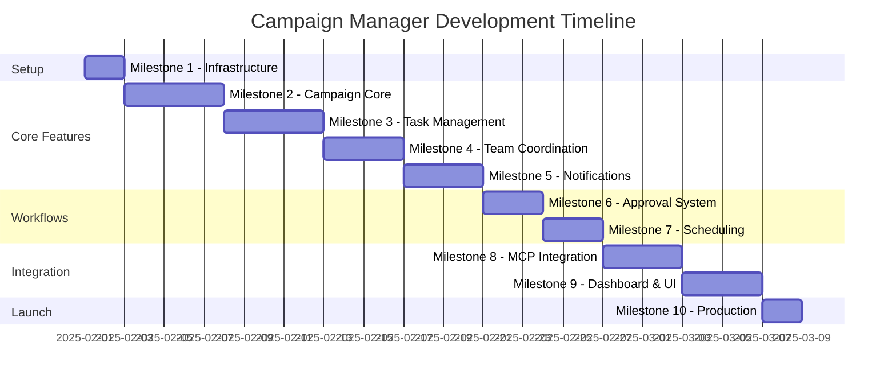

# Campaign Manager - Milestone Implementation Plan

## Document Information
- Version: 1.0
- Date: 2025-09-20
- Status: Active
- Purpose: Define phased development milestones for Campaign Manager
- Total Duration: 10 weeks
- Language: TypeScript
- Methodology: Test-Driven Development

## Development Timeline



## Milestone 1: Infrastructure & Setup

### Duration: 2 days
### Branch: `feature/initial-setup`

#### Objectives
- Set up TypeScript project with Fastify
- Configure PostgreSQL with Prisma
- Set up Redis and BullMQ
- Configure testing framework
- Docker environment setup

#### Deliverables
```
✓ Repository structure
✓ TypeScript configuration
✓ Fastify server boilerplate
✓ Prisma schema and migrations
✓ Jest test configuration
✓ Docker Compose setup
✓ CI/CD pipeline (GitHub Actions)
```

#### Test Requirements (10 tests)
```typescript
// tests/infrastructure/setup.test.ts
describe('Infrastructure', () => {
  test('Fastify server starts successfully');
  test('PostgreSQL connection established');
  test('Redis connection established');
  test('Prisma migrations run successfully');
  test('JWT authentication configured');
  test('Environment variables validated');
  test('Health check endpoint responds');
  test('Logging configured correctly');
  test('Docker containers start');
  test('TypeScript builds without errors');
});
```

#### Acceptance Criteria
- [ ] `pnpm install` completes successfully
- [ ] `pnpm dev` starts server on port 3001
- [ ] `pnpm test` runs and passes
- [ ] `docker-compose up` starts all services
- [ ] Health check returns 200 OK

---

## Milestone 2: Campaign Core Functionality

### Duration: 5 days
### Branch: `feature/campaign-core`

#### Objectives
- Campaign CRUD operations
- Timeline generation engine
- Milestone management
- Campaign state machine
- Database models

#### Deliverables
```typescript
// src/services/campaign/campaign.service.ts
export class CampaignService {
  createCampaign(data: CreateCampaignDto): Promise<Campaign>;
  updateCampaign(id: string, data: UpdateCampaignDto): Promise<Campaign>;
  getCampaign(id: string): Promise<Campaign>;
  listCampaigns(filters: CampaignFilters): Promise<PaginatedResult<Campaign>>;
  deleteCampaign(id: string): Promise<void>;
  transitionStatus(id: string, newStatus: CampaignStatus): Promise<Campaign>;
}

// src/services/timeline/timeline.service.ts
export class TimelineService {
  generateTimeline(campaign: Campaign): Promise<Timeline>;
  applyTemplate(template: string): Timeline;
  calculateMilestones(targetDate: Date, type: string): Milestone[];
  identifyCriticalPath(tasks: Task[]): string[];
  addBuffer(timeline: Timeline, hours: number): Timeline;
}
```

#### Test Requirements (25 unit tests, 10 integration tests)
```typescript
// Unit Tests
- Campaign creation with validation
- Timeline generation for each campaign type
- Milestone calculation logic
- Status transition validation
- Schedule conflict detection
- Template application
- Buffer time calculation
- Critical path identification

// Integration Tests
- Full campaign creation flow
- Database persistence
- Concurrent campaign handling
- Transaction rollback
- Query performance
```

#### Acceptance Criteria
- [ ] All CRUD operations working
- [ ] Timeline auto-generated for campaigns
- [ ] 90% test coverage on services
- [ ] API endpoints return correct data
- [ ] Database indexes optimized

---

## Milestone 3: Task Management System

### Duration: 5 days
### Branch: `feature/task-management`

#### Objectives
- Task CRUD operations
- Intelligent task assignment
- Dependency management
- Progress tracking
- Blocker handling

#### Deliverables
```typescript
// src/services/task/task.service.ts
export class TaskService {
  createTask(data: CreateTaskDto): Promise<Task>;
  updateTask(id: string, updates: Partial<Task>): Promise<Task>;
  assignTask(taskId: string, assigneeId: string): Promise<Task>;
  completeTask(taskId: string, notes?: string): Promise<Task>;
  blockTask(taskId: string, reason: string): Promise<Task>;
  getDependencies(taskId: string): Promise<Task[]>;
}

// src/services/assignment/assignment.service.ts
export class AssignmentService {
  autoAssign(task: Task): Promise<TeamMember>;
  calculateWorkload(memberId: string): Promise<number>;
  matchSkills(task: Task, members: TeamMember[]): TeamMember[];
  reassignTask(taskId: string, newAssigneeId: string): Promise<void>;
  balanceWorkload(campaignId: string): Promise<AssignmentResult[]>;
}
```

#### Test Requirements (30 unit tests, 12 integration tests)
```typescript
// Unit Tests
- Task creation with dependencies
- Assignment algorithm (skills, workload, availability)
- Status transitions
- Blocker management
- Progress tracking
- Workload calculation
- Skill matching
- Timezone considerations

// Integration Tests
- Task assignment flow
- Dependency resolution
- Concurrent task updates
- Notification triggering
- Performance with 1000+ tasks
```

#### Acceptance Criteria
- [ ] Tasks auto-assigned based on skills
- [ ] Workload balanced across team
- [ ] Dependencies tracked correctly
- [ ] 85% test coverage
- [ ] API endpoints tested

---

## Milestone 4: Team Coordination

### Duration: 4 days
### Branch: `feature/team-coordination`

#### Objectives
- Team member management
- Availability tracking
- Skill management
- Workload visualization
- Performance metrics

#### Deliverables
```typescript
// src/services/team/team.service.ts
export class TeamService {
  getTeamMembers(): Promise<TeamMember[]>;
  updateAvailability(memberId: string, schedule: Schedule): Promise<void>;
  getWorkload(memberId: string): Promise<Workload>;
  getTeamCapacity(date: Date): Promise<Capacity>;
  findAvailableMembers(requirements: Requirements): Promise<TeamMember[]>;
}

// src/services/metrics/performance.service.ts
export class PerformanceService {
  getMemberMetrics(memberId: string): Promise<MemberMetrics>;
  getTeamMetrics(period: Period): Promise<TeamMetrics>;
  calculateProductivity(memberId: string): Promise<number>;
  identifyBottlenecks(): Promise<Bottleneck[]>;
}
```

#### Test Requirements (20 unit tests, 8 integration tests)
```typescript
// Unit Tests
- Availability calculation
- Workload distribution
- Capacity planning
- Skill matching
- Performance calculations
- Bottleneck detection

// Integration Tests
- Team dashboard data
- Real-time updates
- Concurrent availability updates
- Performance report generation
```

#### Acceptance Criteria
- [ ] Team dashboard functional
- [ ] Workload visible per member
- [ ] Availability calendar working
- [ ] Performance metrics accurate
- [ ] 85% test coverage

---

## Milestone 5: Notification System

### Duration: 4 days
### Branch: `feature/notifications`

#### Objectives
- Multi-channel notifications
- Smart reminder system
- Escalation logic
- Notification preferences
- Delivery tracking

#### Deliverables
```typescript
// src/services/notification/notification.service.ts
export class NotificationService {
  send(notification: Notification): Promise<void>;
  schedule(notification: Notification, date: Date): Promise<void>;
  sendBatch(notifications: Notification[]): Promise<void>;
  trackDelivery(notificationId: string): Promise<DeliveryStatus>;
}

// src/services/escalation/escalation.service.ts
export class EscalationService {
  escalate(issue: Issue, level: number): Promise<void>;
  getEscalationPath(issue: Issue): EscalationLevel[];
  autoEscalate(trigger: Trigger): Promise<void>;
}

// src/workers/notification.worker.ts
export class NotificationWorker {
  process(job: Job<NotificationPayload>): Promise<void>;
  retry(job: Job, error: Error): Promise<void>;
  handleFailure(job: Job, error: Error): Promise<void>;
}
```

#### Test Requirements (25 unit tests, 10 integration tests)
```typescript
// Unit Tests
- Channel routing (Slack, email, in-app)
- Reminder scheduling
- Escalation triggers
- Batching logic
- Retry mechanism
- Delivery tracking

// Integration Tests
- Slack API integration
- Email delivery
- Queue processing
- Concurrent notifications
- Rate limiting
```

#### Acceptance Criteria
- [ ] Notifications delivered to all channels
- [ ] Reminders scheduled correctly
- [ ] Escalation working
- [ ] Queue processing stable
- [ ] 85% test coverage

---

## Milestone 6: Approval Workflow

### Duration: 3 days
### Branch: `feature/approval-system`

#### Objectives
- Multi-stage approvals
- Approval routing
- Auto-approval logic
- Feedback consolidation
- Version tracking

#### Deliverables
```typescript
// src/services/approval/approval.service.ts
export class ApprovalService {
  requestApproval(campaign: Campaign, stage: string): Promise<Approval[]>;
  processDecision(approvalId: string, decision: Decision): Promise<void>;
  checkApprovalStatus(campaignId: string): Promise<ApprovalStatus>;
  autoApprove(approvalId: string): Promise<void>;
  consolidateFeedback(approvals: Approval[]): Feedback;
}

// src/services/validation/content.validator.ts
export class ContentValidator {
  validateContent(content: Content): ValidationResult;
  checkBrandCompliance(content: Content): ComplianceResult;
  validateLinks(content: Content): LinkValidation[];
  checkAccessibility(content: Content): AccessibilityResult;
}
```

#### Test Requirements (18 unit tests, 7 integration tests)
```typescript
// Unit Tests
- Approval request creation
- Decision processing
- Unanimous vs majority logic
- Auto-approval timeout
- Feedback consolidation
- Content validation rules

// Integration Tests
- Full approval flow
- Multi-stage approvals
- Notification on approval
- Database transactions
```

#### Acceptance Criteria
- [ ] Approval workflow functional
- [ ] Auto-approval working
- [ ] Content validation complete
- [ ] 85% test coverage
- [ ] API endpoints tested

---

## Milestone 7: Scheduling Engine

### Duration: 3 days
### Branch: `feature/scheduling-engine`

#### Objectives
- Campaign scheduling
- Conflict detection
- Optimal time calculation
- Capacity planning
- Schedule optimization

#### Deliverables
```typescript
// src/services/scheduling/scheduler.service.ts
export class SchedulerService {
  scheduleCapaign(campaign: Campaign): Promise<Schedule>;
  detectConflicts(date: Date): Promise<Conflict[]>;
  findOptimalSlot(requirements: Requirements): Promise<Date>;
  checkCapacity(date: Date): Promise<Capacity>;
  optimizeSchedule(campaigns: Campaign[]): Promise<Schedule[]>;
}

// src/services/scheduling/optimizer.service.ts
export class OptimizerService {
  calculateOptimalTime(audience: Audience, type: string): Date;
  avoidOverlap(campaigns: Campaign[]): Schedule[];
  balanceLoad(campaigns: Campaign[], period: Period): Schedule[];
}
```

#### Test Requirements (15 unit tests, 6 integration tests)
```typescript
// Unit Tests
- Conflict detection algorithm
- Optimal time calculation
- Capacity checking
- Schedule optimization
- Blackout date handling

// Integration Tests
- Full scheduling flow
- Concurrent scheduling
- Performance with 100+ campaigns
```

#### Acceptance Criteria
- [ ] Scheduling conflicts detected
- [ ] Optimal times calculated
- [ ] Capacity limits enforced
- [ ] 85% test coverage

---

## Milestone 8: MCP Integration

### Duration: 4 days
### Branch: `feature/mcp-integration`

#### Objectives
- MCP protocol implementation
- Marketing Agent integration
- Mailjet Agent integration
- Slack Manager integration
- Tool exposure

#### Deliverables
```typescript
// src/services/mcp/mcp.service.ts
export class MCPService {
  registerTools(): Promise<void>;
  callTool(agent: string, tool: string, params: any): Promise<any>;
  handleToolCall(tool: string, params: any): Promise<any>;
}

// src/integrations/marketing.client.ts
export class MarketingClient {
  handoffCampaign(campaign: Campaign): Promise<HandoffResult>;
  getPerformanceData(campaignId: string): Promise<Performance>;
  getAudienceInsights(segments: string[]): Promise<Insights>;
}

// src/integrations/slack.client.ts
export class SlackClient {
  postToChannel(channel: string, message: string): Promise<void>;
  sendDirectMessage(userId: string, message: string): Promise<void>;
  createThread(channel: string, message: string): Promise<string>;
}
```

#### Test Requirements (20 unit tests, 12 integration tests)
```typescript
// Unit Tests
- MCP tool registration
- Tool call handling
- Response validation
- Error handling
- Retry logic

// Integration Tests
- Marketing Agent communication
- Mailjet Agent validation
- Slack Manager notifications
- End-to-end handoff
```

#### Acceptance Criteria
- [ ] MCP tools exposed correctly
- [ ] Inter-agent communication working
- [ ] Slack notifications sent
- [ ] 80% test coverage
- [ ] Mock servers working

---

## Milestone 9: Dashboard & Real-Time UI

### Duration: 4 days
### Branch: `feature/dashboard-ui`

#### Objectives
- Dashboard API endpoints
- WebSocket implementation
- Real-time updates
- Calendar view
- Analytics dashboards

#### Deliverables
```typescript
// src/websocket/socket.server.ts
export class SocketServer {
  handleConnection(socket: Socket): void;
  broadcastUpdate(event: string, data: any): void;
  sendToUser(userId: string, event: string, data: any): void;
  handleSubscription(socket: Socket, channel: string): void;
}

// src/api/routes/dashboard.ts
export async function dashboardRoutes(app: FastifyInstance) {
  app.get('/dashboard', getDashboard);
  app.get('/dashboard/calendar', getCalendar);
  app.get('/dashboard/metrics', getMetrics);
  app.get('/dashboard/activity', getActivity);
}
```

#### Test Requirements (18 unit tests, 8 integration tests)
```typescript
// Unit Tests
- Dashboard data aggregation
- Calendar view generation
- Metrics calculation
- Activity feed
- WebSocket message handling

// Integration Tests
- Real-time updates
- Multiple client connections
- Dashboard API performance
- WebSocket reconnection
```

#### Acceptance Criteria
- [ ] Dashboard endpoints working
- [ ] WebSocket updates real-time
- [ ] Calendar view functional
- [ ] 85% test coverage
- [ ] Performance < 1s load time

---

## Milestone 10: Production Deployment

### Duration: 2 days
### Branch: `release/v1.0.0`

#### Objectives
- Production configuration
- Performance optimization
- Security hardening
- Monitoring setup
- Documentation finalization

#### Deliverables
```
✓ Production environment variables
✓ Database migrations executed
✓ Redis cluster configured
✓ Load balancer setup
✓ SSL certificates
✓ Monitoring dashboards
✓ Alert rules configured
✓ Backup procedures
✓ Rollback plan
✓ API documentation
```

#### Test Requirements (15 smoke tests)
```typescript
// Smoke Tests
describe('Production Smoke Tests', () => {
  test('Health check endpoints respond');
  test('Database connections stable');
  test('Redis cache operational');
  test('Queue processing active');
  test('WebSocket server running');
  test('Authentication working');
  test('Campaign creation flow');
  test('Task assignment working');
  test('Notifications delivered');
  test('MCP tools accessible');
  test('Dashboard loads');
  test('Monitoring active');
  test('Logs aggregating');
  test('Backup system working');
  test('Rate limiting enforced');
});
```

#### Acceptance Criteria
- [ ] All smoke tests passing
- [ ] Performance metrics met
- [ ] Security scan passed
- [ ] Monitoring active
- [ ] Documentation complete

---

## Development Workflow

### Branch Strategy
```
main
  ├── develop
  │     ├── feature/campaign-core
  │     ├── feature/task-management
  │     └── feature/notifications
  └── release/v1.0.0
```

### PR Process per Milestone
1. Create feature branch from `develop`
2. Write tests first (TDD)
3. Implement features
4. Run `pnpm test:coverage`
5. Create PR with checklist
6. Pass CI/CD checks
7. Claude Code Review
8. Merge to develop
9. Deploy to staging

## Success Metrics

### Per Milestone
- ✅ Test coverage > 85%
- ✅ All tests passing
- ✅ Claude Code Review approved
- ✅ Performance benchmarks met
- ✅ No critical bugs
- ✅ Documentation updated

### Overall Project
- ✅ 10 milestones completed
- ✅ <100ms API response (p95)
- ✅ <2s task assignment time
- ✅ 99.9% uptime target
- ✅ Support 1000+ campaigns
- ✅ Handle 100+ team members

## Risk Mitigation

### Technical Risks
| Risk | Mitigation | Contingency |
|------|------------|-------------|
| MCP integration delays | Build with mocks first | Direct HTTP APIs |
| Performance issues | Load test early | Add caching layers |
| Complex workflows | Incremental complexity | Simplify MVP |
| WebSocket stability | Fallback to polling | Use Socket.io |
| Database scaling | Optimize queries | Add read replicas |

## Team Resources

### Required Skills
- TypeScript expert (Lead)
- Fastify/Node.js developer
- PostgreSQL/Prisma specialist
- BullMQ/Redis expert
- Testing specialist
- DevOps engineer

### Time Allocation
- Development: 70%
- Testing: 20%
- Documentation: 5%
- Code review: 5%

## Testing Strategy

### Test Distribution
- Unit tests: 60% (180 tests)
- Integration tests: 30% (90 tests)
- E2E tests: 10% (30 tests)
- **Total**: ~300 tests

### Coverage Goals
- Services: 90%
- API routes: 85%
- Workers: 85%
- Overall: 85%

## Post-Launch

### Week 11-12 Activities
- Performance tuning
- User feedback incorporation
- Bug fixes
- Feature requests triage
- Documentation updates
- Team training

## Communication Plan

### Daily Standups
- Current milestone progress
- Blockers and solutions
- Test coverage status
- PR reviews needed

### Weekly Reviews
- Milestone completion
- Performance metrics
- Risk assessment
- Next milestone prep

### Milestone Completion
- Demo to stakeholders
- Retrospective meeting
- Documentation review
- Celebrate success! 🎉